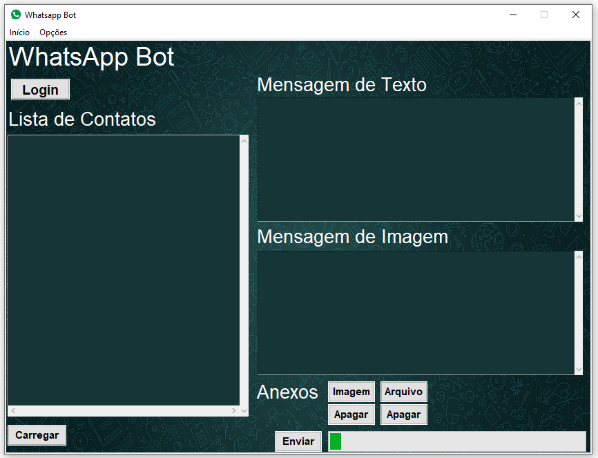

### Whatsapp bot
> Projeto de RPA escrito em python para disparo em massa de mensagens de whatsapp, permitindo enviar imagens, vídeos ou documentos como anexo.

> O sistema permite selecionar uma arquivo com vários contatos, que são carregados na tela, permitindo enviar em massa, mensagens de whatsapp para os contatos selecionados, através do login com QR code do whatsapp web. As mensagens a serem enviadas são inseridas no campo 'Mensagem' e os anexos inseridos com os botões 'Imagem' e 'Arquivo'.

#### Interface

### Passos para disparo
* Montar Lista
    * Arquivos: .xlsx, .xls ou .txt.
    * Regras
        * Um único contato por linha;
        * Manter o arquivo de contatos sempre fechado.
* Carregar Arquivo de Contatos
    * Clicar em 'Carregar' e selecionar arquivo.
* Logar
    * Clicar em 'Whatsapp Web'
    * Aguardar página abrir
    * Scanear o QR Code
* Digitar mensagem no campo 'Mensagem'
* Selecionar Imagem, Video ou Arquivo a ser enviado.
* Selecionar contatos a receber a mensagem
* Enviar clicando em 'Enviar'
### Ambiente de Desenvolvimento
Tkinter

### Meta

Lucas Peixoto - [linkedin](https://www.linkedin.com/in/lucassacramoni/)

E-mail - lucas.sacramoni@yahoo.com

Projeto - https://github.com/lucasspeixoto/whatsapp_bot.git